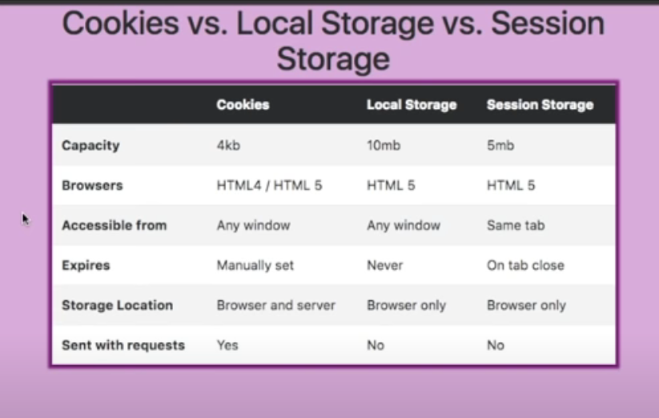
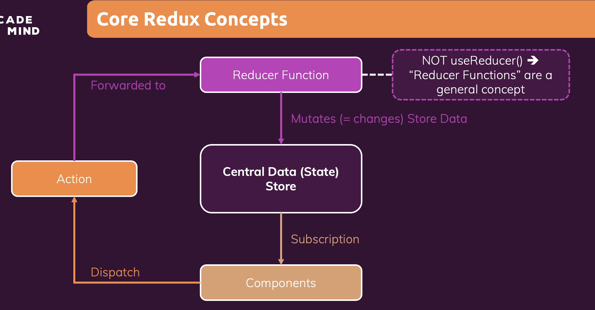

# questions
1.  composition vs inheritance
2.  single threaded ->>>> then how it achieves concurrency >>>> how node js handles multiple requests
3.  splice vs slice
4.  virtual DOM, how it works
5.  passing data between siblings,parent,children
6.  unit testing
7.  polyfills
8.  override (hasOwnProperty);
9.  scss vs sass
10. types of sockets
11. inheritance all types in js vs java
12. SEO
13. MVC feature design ,what is view
14. Microservices
15. two way vs one way binding how it works
16. system design questions
17. monolithic vs microservices
18. creating a calendar
19. nosql vs sql
20. generating a pdf
21. caching & logging for both client side vs server side
22. drag and drop nested li ..make any node the child or the parent
23. what are different lifecycle methods, when to use any and why
24. remove one element from an array ie. use split slice etc.
25. n number of nested promises calling ie. tell who will execute first

<!-- DSA -->

1. Max no. of repeating characters in a string
2. Move all zero's to the end in an array
3. Remove Duplicates and Count the duplicates from an array
4. Reverse an string
5. Sort an array


<!-- General  -->

1. Pipeline Experience you have?
2. Agile Methodologies: Is it followed?
3. Local Storage vs Session Storage vs Cookie (Lifecycle)
4. What are the security measures you take while building an application?
5. Have you used JWT? Advantages of It
6. Explain the current project and its architecture
7. SPA vs MPA
8. What is web accessibility?
9. What is caching mechanism and service workers?
10. How do you optimize your website for better load times?
11. What is minification?
12. When a response is sent from the server to the browser, what gets loaded first: HTML, CSS, or JS?
13. Code splitting and how do we perform it?

<!-- HTML -->

1. HTML Entities
2. Block vs Inline Elements
3. Semantic HTML/Elements
4. Why we need meta tags in a website?
5. CSS vs CSS3
6. Latest Input Type Tags
7. HTTP Request Life Cycle

<!-- CSS -->

1. Explain Box Model (actual width/height might be different from what you think)
2. Different CSS Selectors
3. CSS Specificity
4. Padding vs Margin
5. display:none vs visibility:hidden vs opacity:0
6. CSS Modules and What is SCSS
7. rem vs em vs px Properties
8. Centering a Div in a body tag
9. Align three divs into three equal parts on the screen (Using Flexbox)
10. Explain Flexbox Property
11. Flexbox vs Grid
12. Z-Index
13. How to Make a Website Responsive using CSS
14. Different Positioning Properties
15. What are Mixins and How Are They Helpful in CSS?
16. How to center align an image inside a div
17. How to Apply a Linear Gradient on Text + Achieving the Same Effect Without Transition
18. Responsive vs Adaptive design

<!-- Javascript -->

1. Explain different design patterns (Todo)
2. var vs let vs const (with the help of hoisting)
3. Closure
4. Is closure automatically garbage collected, and is it a good thing or a bad thing?
5. Explain some ES6/ES7 features
6. Spread vs Rest
7. typeof null == undefined (typeof null === undefined)
8. Primitive vs Non-primitive data types
9. Variable vs Function Hoisting
10. `console.log([..."sandip"], 1+"2")`: Is a string iterable?
11. slice vs splice
12. DeepCopy vs ShallowCopy (Different ways to copy an object)
13. Function Currying
14. Arrow vs Traditional function
15. Event Bubbling and how to prevent it
16. Event Delegation
17. call vs apply vs bind
18. Polyfill (forEach, map)
19. Object.freeze
20. map vs filter
21. reduce vs sort
22. Validate an email using JS
23. IIFE's (Immediately Invoked Function Expressions)
24. Coercion vs Hoisting
25. Uses of (Promise.all vs Promise.any vs Promise.race)
26. What are Pure Functions
27. BOM (Browser Object Model) vs DOM (Document Object Model)
28. Event Loop
29. Angular vs React
30. What is dangerouslySetInnerHTML and why should I use it?
30. Find the even number [1,2,3,4,5,6,7,8,9]
    [1, 2,3, 4, 5,6,7,8,9].filter(item => item % 2 === 0)
    [1, 2,3, 4, 5,6,7,8,9].map(item => item % 2)
31. What are generator functions ?
32. OOPS in js
33. Nested Properties missing eg. const personalName = data?.level1?.name?.personalName ?? 'Default Value';
34. add "John" after the "Hello" word in the string "Hello How are you ?"
35. const arr = [1,2,3] 
    arr.foo = 4;
    for(let i in arr){
    console.log(i)
    }
36. let i;
    for (i=0; i<3; i++) {
      const log = () => {
        console.log(i);
      }
      setTimeout(log, 100);
    }
37. new Promise(res => res(2))
    .then((v) => {
    console.log(v);
    return v * 2;
    }).then((v) => {
    console.log(v);
    return v * 2;
    }).finally((v) => {
    console.log(v);
    return v * 2;
    }).then((v) => {
    console.log(v);
    })
38. sort this array alphabetically
var arr = [{name:"Palak"},
{name:"Akarsh"},
{name:"Parag"},
{name:"Saif"},
{name:"Manish"}
]
39.  Implement cache/memoize function
eg. const clumsyProduct = (num1, num2) => {
  for(let i = 1; i <= 10000000; i++){}
    return num1 * num2;
}

const myMemoize = (fn, context) => {
  const res = {};
  return (...args) => {
    var argsCache = JSON.stringify(args);
    if(!res[argsCache]) {
      res[argsCache] = fn.call(context || this, ...args)
    }
    return res[argsCache];
  }
}


<!-- React -->

1. What are High Order Components
2. What are Pure Components and how to decide when to use them
3. Redux vs Context API
5. Understand Redux very well (redux workflow)
5. useSelector vs useDispatch vs connect ("react-redux" / connecting components to store)
6. Flux Architecture
7. Different React Lifecycle Methods Available and order of their execution
8. class vs functional component and which one should be used in what scenario
8. Handling sideEffect using useEffect hooks (doing HTTP request, setting timer/interval, storing user info in localStorage/cookies)
9. useMemo vs useCallback vs useRef
10. What are middlewares and why to use
11. Implementing Routing in React
12. Page Level Error Handling in React App (With Class and Functional Component Both)
13. Explain Lazy Loading
14. Why typescript is used
15. How to style React Components (Material UI, SCSS, StyledComponents)
16. Describe Testing Strategy 
17. How to implement localization/translation
19. redux saga vs redux thunk
20. nextjs vs react
21. when is unmounting of a component needed
22. why reducer is called pure function
23. controlled vs uncontrolled components
25. what are refs in react and show an example
26. is setState async operation ?
27. Pure Components, Presentational Components, Dumb Components
28. When you're passing a function as a prop to the child component,how to avoid child component to re-render
29. Library vs Framework

<!-- Node -->

1. Create a React Sample Component that does a API call
2. Routing in NodeJs

<!-- DataBase -->

1. MySQL VS MongoDB


<!-- 
------------------------------------------------------------------------------------------
------------------------------------------------------------------------------------------
------------------------------------------------------------------------------------------
 -->


# General

### Cookie vs Local storage vs Session storage



- Authentication: (Identity Verify)

- Authorization: (Permission Verify)

- **stateful** (i.e. session using a cookie)
- **stateless** (i.e. token using `JWT` / `OAuth` / other)

### Sessions

- server verifies the credentials against the DB
- server creates a temporary user **session**
- sever issues a cookie with a **session ID**
- user sends the cookie with each request
- server validates it against the session store & grants access
- when user logs out, server destroys the sess. & clears the cookie
- every user session is stored server-side (**stateful**)
- each user is identified by a session ID
- no 3rd party can extract data out
  - only issuer (server) can map back to data
- stored in a cookie
  - signed with a secret
  - protected with flags
- SSR web apps, frameworks (`Spring`, `Rails`), scripting langs (`PHP`)
- *rarely* encrypted (`AES`) to protected from being read
  - no security concern if read by 3rd party
  - carries no meaningful data (random string)
  - even if encrypted, still a 1-1 match
- unauthorized actions on behalf of the authenticated user
- mitigated with a CSRF token (e.g. sent in a separate `X-CSRF-TOKEN` cookie)


### Testing and Code Quality Strategy

`Unit Testing` => <br>
`Integration Testing` => two services talking to each other, multiple components involved <br>
`End To End Testing` =>

`Testing Framework`
- Eg. Jest, Jasmine, Mocha
- Test runner + Assertion library + Mocking capabilities(Stub/Spy)
- Comprehensive tool for running and managing tests
- **Test runner** =>  Find Test run them and make assertions
- **Assertion** => assert, shouldExpect eg. Chai, Jest, Jasmine
- **Mocking** => eg. Sinon, Test double, Jest

`Static Code Analysis` => Improves code quality, code correctness,  best practices, or potential errors eg. ES Lint, Flow-typed <br>
`Style Rules/Code Formatting` => Prettier


<!-- 
------------------------------------------------------------------------------------------
------------------------------------------------------------------------------------------
------------------------------------------------------------------------------------------
 -->


# HTML
### 1.HTML Entities

- special codes used in HTML to represent `reserved character`,`special meaning characters`
- `&lt;` represents `<`
- `&copy;` represents `©`

### 2.Block vs Inline Elements

`Block`
- stacking vertically , take up the full available width of their parent container, pushing other elements vertically below them
- eg. `<div>, <p>, <h1> to <h6>, <ul>, <ol>, <li>`
- used to structure the layout of a webpage into sections or containers

`InLine`
- do not create new block 
- occupy as much width as necessary for their content
- eg.`<span>, <a>, <strong>, <em>, , <br>`

For example, you might use inline elements to make text bold `<strong>`, italic `<em>`, create hyperlinks `<a>`, or insert images `` within a paragraph

### 3.Semantic HTML

- describe web content structure in a way that is both human-readable and machine-understandable
- improves accessibility and SEO of a web page but also helps maintain a clear and organized structure for web content
- eg. `<header>`,`<nav`,`<main>`,`<article>`,`<section>`,`<aside>(sidebars, advertisements)`, `<footer>(metadata, copyright information, contact details)`

### 4.Why we need meta tags in a website?

- SEO: improve page's ranking in search engine results, `<title>, <meta name="description">, <meta name="keywords">`
- Browser Display: character encoding, viewport settings, `<meta charset="UTF-8">, <meta name="viewport">`
- Social Media Sharing: `<meta property="og:image">`


<!-- 
------------------------------------------------------------------------------------------
------------------------------------------------------------------------------------------
------------------------------------------------------------------------------------------
 -->


# CSS
### Different Positioning Properties

`Static`
- Default value, no effect

`Relative`
- relative to their normal position in the document flow
- Other elements in the document flow will not be affected by this element's position change
- element space is reserved in the document flow

`Absolute`
- positioned relative to its closest positioned ancestor element that has value other than `position: static`
- if there's no positioned ancestor element, it is positioned relative to the `<html>/viewpoort` element
- element removed from the normal document flow ,No space is created for the element in the page layout

`Fixed`
- similar to absolute positioned element removed from the normal document flow
- always positioned relative to the `<html>/viewport` element

### display:none vs visibility:hidden

`display:none`
- completely removed from the document flow, does not occupy any space on the page
- User interactions, such as clicking or tabbing, cannot target the hidden element
- it is inaccessible to screen readers

`visibility:hidden`
- keeps the element in the  document flow
- preserves its space, and makes it invisible
- other elements may interact with it
- user can not interact with it


### Inheritance
Occurs when an inheritable CSS property (i.e. color) is not set directly on an element, the parent chain is traversed until a value for that property is found.

```html
<div class="blue">
<p>Lorem Ipsum </p> 
</div>
```
```css
/* paragraph will get blue color through inheritance */
.blue {
  color: blue;
}
```

### Specificity
The algorithm used by browsers to determine which CSS declaration should be applied. Each selector has a calculated weight. The most specific weight wins. <br> Specificity calculations come into play when multiple selectors are trying to style the same element.<br>If there are two or more declarations providing different property values for the same element, the declaration with the most specific selector wins.<br>

#### `Comparsion is done from left to right`
ID Selector: 1-0-0 <br>
Class Selector: 0-1-0 <br>
Type Selector: 0-0-1 <br>


```css
/* Case 1: paragraph will get red color 
as in this case by inheritance it will not traverse the tree as we have a type slector on the paragraph itself
*/
p {
color: red
}
.blue{
color: blue;
}

/* Case 2: paragraph will get blue color as it is a stronger specifier */
p {
color: red
}
.blue p{
color: blue;  
/* specifty: 0-1-1 */
}
```
```html
<!-- Question -->
<ul class="list">
<li class="list-item"><a id="link-1" href="#">Link1</a></li>
<!-- color is Blue -->
<!-- Link 1 and Link 3 is targeted by three declarations 0-0-1 (1st), 0-0-1 (2nd), 0-1-1 (4th)-->
<!-- 4th wins -->
<li class="list-item"><a id="link-2" href="#">Link2</a></li> 
<!-- color is Red -->
<!-- Link 2 is targeted by three declarations 1-1-1 (3rd), 1-0-1 (5th), 1-1-1 (6th) -->
<!-- 6th wins  as it is lower in order-->
<li class="list-item"><a id="link-3" href="#">Link3</a></li>
<!-- color is Blue -->
</ul>
```
```css
a {
  color: inherit; 
  /* 0-0-1  */
}
ul {
  color: red;
  /* 0-0-1 */
}
li.list-item #link-2 {
  color: yellow;
  /* 1-1-1  */
}
ul.list {
  color: blue;
  /* 0-1-1  */
}
li #link-2 { 
  /* 1-0-1 */
  color: orange;
}
ul.list #link-2 {
  /* 1-1-1 */
  color: red;
}
```


<!-- 
------------------------------------------------------------------------------------------
------------------------------------------------------------------------------------------
------------------------------------------------------------------------------------------
 -->


# Javascript
### 1. Different ways to copy an object

`Shallow Copy:` Use when you want to duplicate an object quickly, and it's acceptable for nested objects to be shared between the original and the copy. <br>
`Deep Copy:` Use when you need a completely independent duplicate of an object, especially in cases where you want to avoid unintended side effects due to shared references.

- Object Spread Operator (Shallow Copy):
```javascript
const originalObject = { a: 1, b: { c: 2 } };
const shallowCopy = { ...originalObject };
shallowCopy.b.c = 3; // Changes b.c in both shallowCopy and originalObject
```
- Object.assign() Method (Shallow Copy):
```javascript
const source = { a: 1, b: { c: 2 } };
const target = {};
const copiedObject = Object.assign(target,source);
console.log(copiedObject === target);
// if the target object already has same keys, it will be overridden by the source object and return the modified target object
```
- JSON.parse() and JSON.stringify() (Deep Copy, Limited to JSON-Safe Data):
```javascript
const originalObject = { a: 1, b: { c: 2 } };
const copiedObject = JSON.parse(JSON.stringify(originalObject));
```
### 2. Function Currying
A function is transformed into a series of functions, each taking a single argument. This allows you to partially apply a function by fixing some of its parameters and create specialized functions

- `Partial Function Application:` Fix some arguments upfront, leaving the rest to be supplied later
```js
const evaluate = (operation) => {
  return (param1) => {
    return (param2) => {
      if(operation === 'sum') return param1 + param2;
      else if(operation === 'multiply') return param1 * param2;
      else if(operation === 'divide') return param1 / param2;
      else return "Invalid Operation";
    }
  }
}
const multiply = evaluate('multiply');
console.log(multiply(5)(3));
console.log(multiply(4)(3));
```

- `Functional Composition:` Curried functions can be easily composed together to create more complex functions. This allows you to build complex behavior from smaller, reusable functions.
-  `Debouncing and Throttling:` Currying is often used in scenarios like debouncing and throttling, where you want to control the frequency of function calls based on time intervals.
```js
const debounce = (func, delay) => {
  let timeout;
  return (...args) => {
    clearTimeout(timeout);
    timeout = setTimeout(() => func(...args), delay);
  }
}

const debouncedSearch = debounce(searchFunction, 300)
```
```js
const infiniteCurrying = (a) => {
  return (b) => {
    if(b) return infiniteCurrying(a+b);
    return a
  }
}
infiniteCurrying(2)(3)(4)(5)(6)
```
### 3. Arrow Function vs Traditional Function
- Lexical this Binding
- No Arguments Object
- No Binding of this, super, new.target, and prototype (Can not be used as constructor function)
- Traditional Function: Has its own this value, which is dynamically scoped.
- Arrow Function: Inherits the this value from the surrounding scope.
```js
function traditionalFunction() {
  console.log(arguments); // The arguments object is available
}
function Counter() {
  this.count = 0;
  setInterval(() => {
    this.count++; // `this` refers to the Counter instance
  }, 1000);
}
```
### 4. Event Bubbling vs Capturing

The standard DOM Events describes 3 phases of event propagation: <br>

Capturing phase – the event goes down to the element <br>
Target phase – the event reached the target element <br>
Bubbling phase – the event bubbles up from the element <br>

We have a single handler form.onclick, then it can “catch” all clicks inside the form. No matter where the click happened, it bubbles up to `<form>` and runs the handler.<br>
In form.onclick handler:
- `this === event.currentTarget` is the `<form>` element, because the handler runs on it
- `event.target` is the actual element inside the form that was clicked who initiated the event

### 5. Event Delegation

Capturing and bubbling allow us to implement one of the most powerful event handling patterns called event delegation.
The idea is that if we have a lot of elements handled in a similar way, then instead of assigning a handler to each of them – we put a single handler on their common ancestor.
In the handler we get event.target to see where the event actually happened and handle it.

```js
table.onclick = function(event) {
  let target = event.target; // where was the click?

  if (target.tagName != 'TD') return; // not on TD? Then we're not interested

  highlight(target); // highlight it
};
```
### Call vs Apply vs Bind
- call() and apply() are used to invoke a function immediately with a specified context and arguments.
- call() accepts arguments individually, while apply() accepts an array of arguments.
- bind() is used to create a new function with a specified context, which can be invoked later.
```js
func.call(context, ...args);
func.apply(context, args);
newFunc = func.bind(context);
newFunc(...args)
```
### Spread Vs Rest

`Shallow Copy/Merge Multiple Arrays or Objects`
```js
const originalArray = [1, 2, 3];
const originalObject = { name: 'Alice', age: 30 };
const copyArray = [...originalArray]; // Shallow copy
const mergedArray = [...array1, ...array2]; // Merge arrays
const copyObject = { ...originalObject }; // Shallow copy
const mergedObject = { ...obj1, ...obj2 }; // Merge objects
```
`Passing Function Arguments`
```js
const numbers = [1, 2, 3];
console.log(Math.max(...numbers)); // Pass multiple arguments
```
`Expanding an Iterable`
```js
const str = 'hello';
const chars = [...str]; // ['h', 'e', 'l', 'l', 'o']
```

`Collecting Function Arguments`
```js
function sum(...args){
  return args.reduce((acc,item) => acc + item , 0)
}
```
`Destructuring with Rest`
```js
// Using the rest parameter in object destructuring
const { name, age, ...rest } = { name: 'Alice', age: 30, gender: 'female' };
// Using the rest parameter in array destructuring
const [first, second, ...rest] = [1, 2, 3, 4, 5];
```

### Type Coercion

Type coercion refers to the automatic conversion of values from one data type to another, <br>
typically performed during operations or comparisons involving different data types. By using Type Coercion, <br>
JavaScript attempts to make the data types compatible to complete the operation or comparison.


<!-- 
------------------------------------------------------------------------------------------
------------------------------------------------------------------------------------------
------------------------------------------------------------------------------------------
 -->


# React
### Different React Lifecycle methods available and their execution order

`Mounting Phase:`
- constructor(props): initialize state, bind event handlers
- getDerivedStateFromProps(props,state):  called right before rendering when new props or state are received. It returns an object to update the state or null to indicate no state updates are necessary.
when we have to synchronize new props with the component internal's state, derived state calculation
```js
static getDerivedStateFromProps(nextProps, prevState) {
  if (nextProps.isOpen !== prevState.isOpen) {
    return { isOpen: nextProps.isOpen };
  }
  return null;
}

```
- render(): return Component's JSX
- componentDidMount(): after mounted to DOM, data fetching, setting subscriptions, setup WebSocket connection to receive real-time messages.

`Updating Phase:`
- getDerivedStateFromProps(props,state):
- shouldComponentUpdate(nextProps, nextState): when new props or state are received it helps to control whether the component should re-render or not
- render():
- getSnapshotBeforeUpdate(prevProps, prevState): called before the component's changes are committed to the DOM, to capture some information from the DOM (e.g., scroll position) before it potentially changes due to the update.
- componentDidUpdate(prevProps, prevState, snapshot): called after the component's updates are committed to the DOM, performing side effects after a component has re-rendered

`Unmounting Phase:`
- componentWillUnmount(): before the component is removed from the DOM. It's used for cleanup tasks like canceling network requests, removing event listeners, or cleaning up timers,
In a video player component, you can unsubscribe from a video stream.

`Error Handling:`
- componentDidCatch(error,info): called when an error occurs in any component's child during rendering

`Functional Component Example Using React Hooks:`
```js
  const [count, setCount] = useState(0);

  // Equivalent to componentDidMount
  useEffect(() => {
    console.log('Component mounted');
    return () => {
      console.log('Component unmounted'); // Equivalent to componentWillUnmount
    };
  }, []);

  // Equivalent to componentDidUpdate
  useEffect(() => {
    console.log('Count updated: ', count);
    // Cleanup function can be returned here
  }, [count]);
```
### Redux vs Context API

Both solve the prop-drilling problem

- Local State (toggle any button)
- Component Wide State (modal opening)
- App Wide State (user authentication)

`Issues in Context API`
- not good for enterprise level application
- deeply nested context provider difficult to manage
- no Middleware support: to add custom logic, such as logging, async actions, or routing
- scalability: In redux lot of state can be managed easily, and it helps maintain a clean separation between state and presentation logic
```js
<ThemeContextProvider>
  <AuthContextProvider>
  <LocaleContext>
    <App> (Lot of Context to Manage)
  </LocaleContext>
  </AuthContextProvider>
</ThemeContextProvider>
``` 
### Redux Workflow



```js
/*******************************************************************************/
/*******************************************************************************/
/*******************************************************************************/

`Reducer.js`
import { createStore } from "redux";
const initialState = {
  counter: 0
}
// Why reducers are Pure Function ?
// Deterministic => Same Input Same Output
// No Side Effects => Doesn't modify the existing state,returns a brand new state object, helpful in tracking purpose
// Independence => do not depend on or modify variables or data outside of their scope, rely solely on their input parameters (state and action) to compute the new state

const counterReducer = (state = initialState, action) => {
switch (action.type) {
    case "INCREMENT":
      return {
        ...state,
        counter: action.payload || state.counter + 1
      };
      case "DECREMENT":
      return {
        ...state,
        counter: action.payload state.counter - 1
      };
    default:
      return state;
  }
};

const store = createStore(counterReducer);
export default store

/*******************************************************************************/
/*******************************************************************************/
/*******************************************************************************/

`App.js`
import { Provider } from "react-redux";
<Provider store={store}>
<App/>
</Provider>

/*******************************************************************************/
/*******************************************************************************/
/*******************************************************************************/

`Component.js`
import { useSelector, useDispatch } from "react-redux";
// Subscription to Store State
const count = useSelector(state => state.counter);
const dispatch =  useDispatch();

const increment = () => {
  dispatch({
    type: "INCREMENT",
    payload: count + 1
  })
}

/*******************************************************************************/
/*******************************************************************************/
/*******************************************************************************/

`Component.js (Class Based)`
import { connect } from "react-redux";

increment() {
  this.props.incrementProp1();
}
const mapDispatchToProps = (dispatch) => {
  return {
    incrementProp1: () => dispatch({ type: "INCREMENT" })
  }
}
// Subscription to Store State
const mapStateToProps = (state) => {
  return {
    counterProp1: state.counter
  }
}

export default connect(mapStateToProps, mapDispatchToProps)(Component);

/*******************************************************************************/
/*******************************************************************************/
/*******************************************************************************/
```
### Refs in React

- directly interact with a DOM element, such as setting focus, reading input values, or performing animations
- integrating React with third-party libraries that expect direct access to DOM elements, like charting libraries, video players, or date pickers
- integrate React with non-React code
```js
class MyComponent extends React.Component {
  myRef = React.createRef();

  componentDidMount() {
    this.myRef.current.focus(); // Access and manipulate the DOM element
  }

  render() {
    // you assign the ref to an instance property
    return <input ref={this.myRef} />;
  }
}

import { useRef, useEffect } from 'react';

function MyComponent() {
  const myRef = useRef();

  useEffect(() => {
    myRef.current.focus(); // Access and manipulate the DOM element
  }, []);

  return <input ref={myRef} />;
}
```

### When Unmounting is Needed

- Navigation and Routing: component specific to that route unmounted
- Conditional Rendering: modal can be opened or closed
- Cleanup and Resource Release: closing network connections, unsubscribing from event listeners, or canceling asynchronous tasks to prevent memory leaks

### Redux Saga vs Redux Thunk

`Redux-Thunk`
- allows you to write action creators that return functions instead of action objects ,perform asynchronous operations and dispatch actions at the appropriate times
- Readability + Simple Use Cases: Actions + synchronous logic are colocated in action creators,<br>
making the code more readable and understandable, especially for simple asynchronous operations

`Redux-Saga`
- generator function to manage async flow
- fine grained control over how async actions are handled
- complex uses cases: such as managing race conditions, canceling requests, handling polling
- scenarios where isolation of side effect logic is important

### Why Middleware in redux required

- modular + maintainable + scalable
- Separation of Concerns : separate the reducers from side effects (asynchronous tasks, logging, analytics, etc.)
HTTP requests, database interaction, working with web sockets, and handling browser APIs, all of which can introduce non-deterministic behavior 
- Redux design to handle sync actions only
- Control Order of Execution: intercept, modify, or cancel actions before they reach the reducers, which can be useful for handling validation, authentication, and more


<!-- 
------------------------------------------------------------------------------------------
------------------------------------------------------------------------------------------
------------------------------------------------------------------------------------------
 -->


Exercises:


1. Travel Recursively  and find name key values

const menuStructure = [
  {
    "name": "Menu1",
    "link": "Google.com",
    "subitems": [
      {
        "name": "Menu2",
        "link": "Google.com",
      },
    ],
  },
  {
    "name": "Menu3",
    "link": "Google.com",
    "subitems": [
      {
        "name": "Menu4",
        "link": "Google.com",
      },
    ],
  },
];

function Test(menuStructure) {
  const names = [];
  const stack = [...menuStructure];

  while (stack.length > 0) {
    const menuItem = stack.pop();
    names.push(menuItem);

    if (menuItem.subitems && menuItem.subitems.length > 0) {
      stack.push(...menuItem.subitems)
    }
  }

  return names;

}

2. Output Question:

var myObject = {
    foo: "bar",
    func: function () {
        var self = this;
        console.log("outer func:  this.foo= " + this.foo); // bar
        console.log("outer func:  self.foo= " + self.foo); // bar
        (function () {console.log("inner func:  this.foo= " + this.foo); // window
        console.log("inner func:  self.foo= " + self.foo); // window
        }());
    }
};
myObject.func();


3. Certainly! Design patterns can be applied in JavaScript without any specific framework or library like React. Here are some common design patterns and how they can be used in plain JavaScript:

1. **Singleton Pattern**:
   - **Use Case**: Managing a single instance of an object throughout your JavaScript application.
   - **Explanation**: Ensure that there's only one instance of a particular object in your JavaScript code, like a configuration manager or a database connection.

2. **Factory Pattern**:
   - **Use Case**: Creating objects based on certain conditions or parameters.
   - **Explanation**: Define a function or class that creates objects based on input or configuration, providing a more flexible way to instantiate objects.

3. **Observer Pattern**:
   - **Use Case**: Implementing custom event handling or pub-sub systems.
   - **Explanation**: Establish a one-to-many dependency between objects, where one object (the subject) maintains a list of its dependents (observers) and notifies them of state changes.

4. **Decorator Pattern**:
   - **Use Case**: Adding functionality or behavior to objects dynamically.
   - **Explanation**: Attach additional methods or properties to objects at runtime, allowing you to enhance their behavior without modifying their code.

5. **Module Pattern**:
   - **Use Case**: Encapsulating private and public members in JavaScript.
   - **Explanation**: Create a self-contained module with private and public variables and functions, ensuring data encapsulation and avoiding global scope pollution.

6. **Constructor Pattern**:
   - **Use Case**: Creating instances of objects with properties and methods.
   - **Explanation**: Define constructor functions (classes) and use them with the `new` keyword to create new object instances with shared properties and methods.

7. **Prototype Pattern**:
   - **Use Case**: Implementing inheritance and creating object instances with shared methods.
   - **Explanation**: Use prototypes to define methods shared among instances, reducing memory consumption when creating multiple objects.

8. **Factory Function Pattern**:
   - **Use Case**: Creating objects without using classes or constructors.
   - **Explanation**: Define functions that return new object instances with encapsulated data and behavior, similar to factory methods.

9. **Module Revealing Pattern**:
   - **Use Case**: Exposing a selected set of functions or properties while hiding others.
   - **Explanation**: Reveal only specific functions or variables from a module, allowing for better control over what is publicly accessible.

These design patterns can help you write clean, maintainable, and organized JavaScript code, whether you're working on a small script or a large-scale application. Choosing the right pattern depends on the problem you're trying to solve and the architecture of your application.


<!-- Singleton Pattern: -->

const Singleton = (function () {
  let instance;

  function createInstance() {
    // Private variables and methods
    return {
      getInstance: function () {
        if (!instance) {
          instance = createInstance();
        }
        return instance;
      },
      // Other methods and properties
    };
  }

  return {
    // Public methods and properties
    getInstance: function () {
      if (!instance) {
        instance = createInstance();
      }
      return instance;
    },
    // Other methods and properties
  };
})();

const instance1 = Singleton.getInstance();
const instance2 = Singleton.getInstance();

console.log(instance1 === instance2); // Outputs: true

<!-- Factory Pattern: -->

function createPerson(name, age) {
  return {
    name,
    age,
    sayHello: function () {
      console.log(`Hello, my name is ${this.name} and I'm ${this.age} years old.`);
    },
  };
}

const person1 = createPerson("Alice", 30);
const person2 = createPerson("Bob", 25);

person1.sayHello(); // Outputs: Hello, my name is Alice and I'm 30 years old.
person2.sayHello(); // Outputs: Hello, my name is Bob and I'm 25 years old.


class Subject {
  constructor() {
    this.observers = [];
  }

  addObserver(observer) {
    this.observers.push(observer);
  }

  removeObserver(observer) {
    this.observers = this.observers.filter((obs) => obs !== observer);
  }

  notify(data) {
    this.observers.forEach((observer) => observer.update(data));
  }
}

<!-- Observer Pattern: -->

class Observer {
  constructor(name) {
    this.name = name;
  }

  update(data) {
    console.log(`${this.name} received data: ${data}`);
  }
}

const subject = new Subject();
const observer1 = new Observer("Observer 1");
const observer2 = new Observer("Observer 2");

subject.addObserver(observer1);
subject.addObserver(observer2);

subject.notify("Some data");
// Outputs:
// Observer 1 received data: Some data
// Observer 2 received data: Some data


<!-- Decorator Pattern: -->

// Base component
class Coffee {
  cost() {
    return 5;
  }
}

// Decorator 1
class MilkDecorator {
  constructor(coffee) {
    this.coffee = coffee;
  }

  cost() {
    return this.coffee.cost() + 2;
  }
}

// Decorator 2
class SugarDecorator {
  constructor(coffee) {
    this.coffee = coffee;
  }

  cost() {
    return this.coffee.cost() + 1;
  }
}

const myCoffee = new Coffee();
console.log("Cost of coffee:", myCoffee.cost()); // Outputs: Cost of coffee: 5

const coffeeWithMilk = new MilkDecorator(myCoffee);
console.log("Cost of coffee with milk:", coffeeWithMilk.cost()); // Outputs: Cost of coffee with milk: 7

const coffeeWithMilkAndSugar = new SugarDecorator(coffeeWithMilk);
console.log("Cost of coffee with milk and sugar:", coffeeWithMilkAndSugar.cost()); // Outputs: Cost of coffee with milk and sugar: 8


<!-- Module Pattern: -->

const MyModule = (function () {
  const privateVar = "I am private";

  function privateFunction() {
    console.log("This is a private function");
  }

  return {
    publicVar: "I am public",
    publicFunction: function () {
      console.log("This is a public function");
    },
  };
})();

console.log(MyModule.publicVar); // Outputs: I am public
MyModule.publicFunction(); // Outputs: This is a public function
console.log(MyModule.privateVar); // Outputs: undefined (privateVar is not accessible)
MyModule.privateFunction(); // Outputs: TypeError: MyModule.privateFunction is not a function


<!-- Constructor Pattern: -->

function Person(name, age) {
  this.name = name;
  this.age = age;
}

Person.prototype.sayHello = function () {
  console.log(`Hello, my name is ${this.name} and I'm ${this.age} years old.`);
};

const person1 = new Person("Alice", 30);
const person2 = new Person("Bob", 25);

person1.sayHello(); // Outputs: Hello, my name is Alice and I'm 30 years old.
person2.sayHello(); // Outputs: Hello, my name is Bob and I'm 25 years old.


<!-- Factory Function Pattern: -->

function createPerson(name, age) {
  return {
    name,
    age,
    sayHello() {
      console.log(`Hello, my name is ${this.name} and I'm ${this.age} years old.`);
    },
  };
}

const person1 = createPerson("Alice", 30);
const person2 = createPerson("Bob", 25);

person1.sayHello(); // Outputs: Hello, my name is Alice and I'm 30 years old.
person2.sayHello(); // Outputs: Hello, my name is Bob and I'm 25 years old.


var x = {name: "JOHN",};
var x;
console.log(x); 
==============================================
p = {
name: "JOHN",
display: function() {
  console.log(this.name);
  }
}

var x = p.display;
x(); 
========================================
apply and bind

fun1 = fun1.bind(this);


Function.prototype.bind = function(cont,...args){
const func = this;
return ()=> func.(cont,...args)
}
===========================================
base = {
  name: "JOHN",
  display: function() {
    console.log(this.name);
    }
  }
  
    
  child =  {};
  child.__proto__ = base;
  
  
  console.log(child.name);
  child.name = 'Alex';
  console.log(base.name);
  console.log(child.name);  
======================================

=======================iterators vs generator============
=======================forOf vs forEach ============================

 
[16:36] Shashank Mukherjee [HCL]
var a = 10;

function xyz() {

console.log('First Console-', a);

var a = 20;

console.log('Second Console-', a);

}

xyz();

console.log('Third Console-', a);
[16:37] Shashank Mukherjee
var myObject = {

		foo: "bar",

		func: function() {

			var self = this;

			console.log("outer1"+this.foo); 

			console.log("outer2"+self.foo); 

			(function() {

				console.log("inner1"+this.foo); 

				console.log("inner2"+self.foo); 

			}());

		}

	};

	myObject.func();
[16:38] Shashank Mukherjee
const props = [

  { id: 1, name: 'John'},

  { id: 2, name: 'Jack'},

  { id: 3, name: 'Tom'}

];
 
const [,, { name }] = props;

console.log(name);
[16:42] Shashank Mukherjee
// find duplicate characters
 
const strChars = 'banana';
 
function duplicateChars() {};
 
console.log(duplicateChars(strChars)); // [a, n]


  
  
  